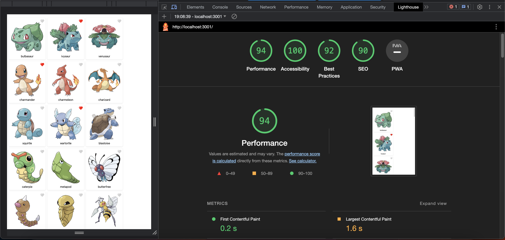
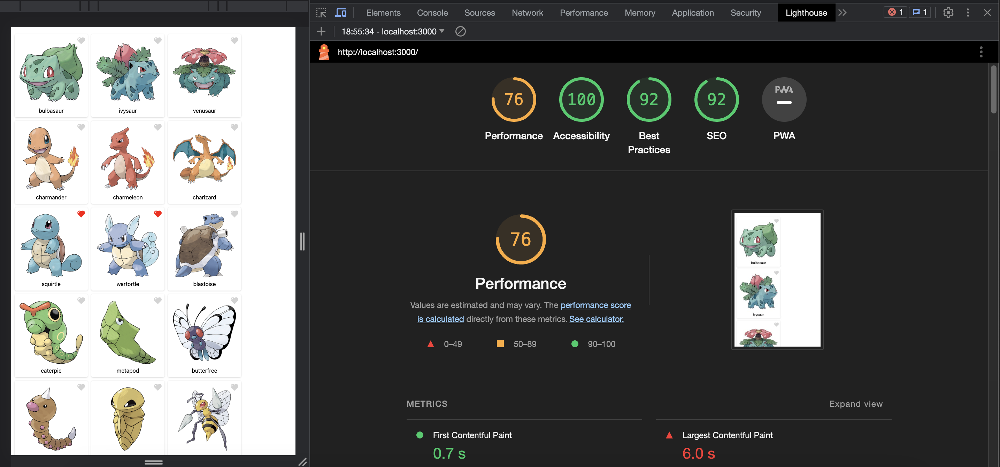

# Otimizando App com Google Lighthouse

## Proposta

Executar o teste do Google Lighthouse no projeto “Lista de Pokémons” e apresentar os resultados da análise, tanto para Mobile quanto para Desktop
 

 

- Desktop

- Mobile

